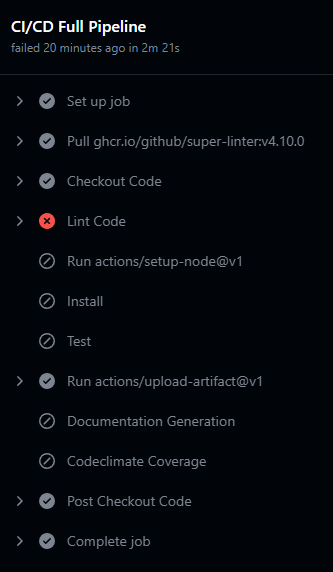

# CICD Phase 1 Status

**Team number:**

7
​

**Team name:**

404

## Current Diagram

## Current Functionality
Here is a picture of our current pipeline running on a commit in GitHub Actions:

Currently:
- The super linter is set up, but we need to configure settings more
- Testing should work once we setup test cases
- Code coverage is setup in actions
- Documentation generation is setup in actions

What we have to do next:
- More thorough testing of current pipeline
- Making sure everything is set up and produces an output
- Adding checks for manual reviews of code
- Adding more configuration for all of our current actions