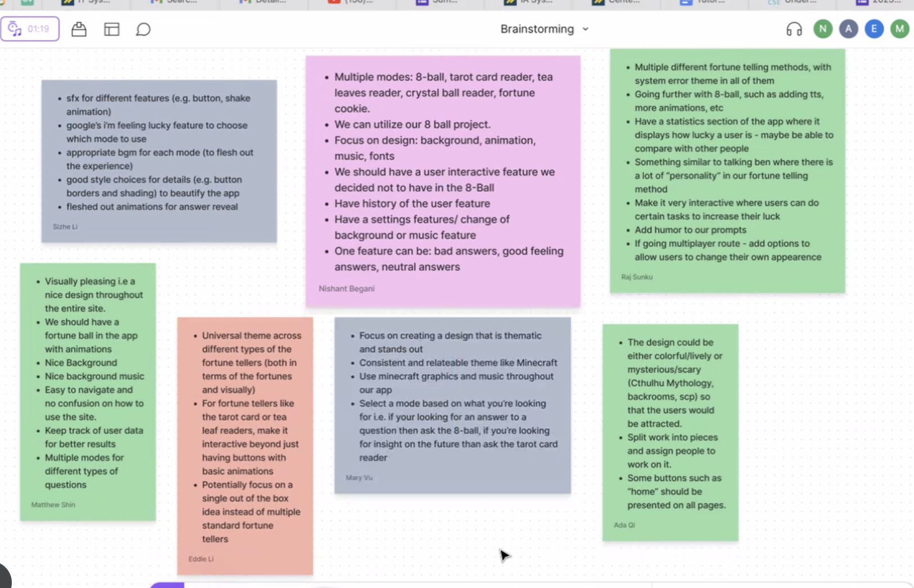

# Meeting Minutes
## Team #7
## Team name: 404
### Date: 4/28/23, Time: 4-5pm, Location: ZOOM

Scribe: Mary Vu

Attendees:
- Nishant
- Raj
- Steven
- Matthew
- Ada
- Eddie
- Ankit
- Mary

Agenda: Brainstorming Fortune Teller Project

- You have a fortune teller which has different modes and the user can choose how they want to look at their fortune i.e. palm reader, crystal ball reader, tarot card reader, etc. 
- Generally each fortune teller app is similar in function so we should focus on making it look good and have unique features in order to stand out
- Requirements: Literally make a fortune teller and we can do anything we'd like
- Everyone comes up with a couple app ideas and put it on a sticky note on Figma and then we can build off of that

Ideas
- Add humor
- Include statistics about how lucky you are
- Include something that's similar to talking ben
- Multiplayer with everyone has a profile
- Make a good video and presentation of what you're doing
2 components to a successful project:
- (1) coding and documentation
- (2) How people react to it, flashy and entertaining
Examples from class: Spongebob characters and conch shell for 8-ball
- Should we focus on having multiple modes or just one mode and focus on quality features
- We want to focus on being out of the box
