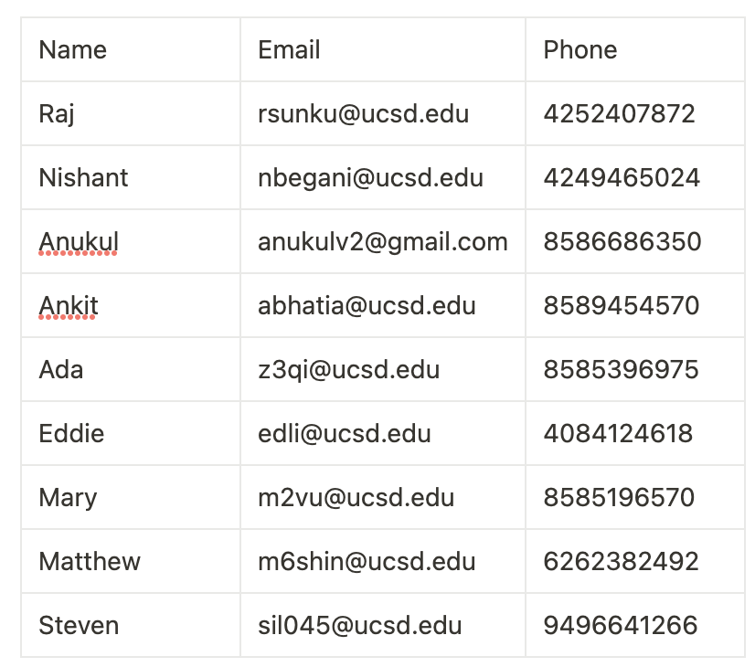

# Team Working Agreement
# Term: Spring 2023
# Creation: 4/18/2023

### Scribe: Mary

## 1. Group Identification
- Instructor: Professor Powell
- Team Name: 404
- Team Number 7

Team member information:

## 2. Primary Means of Communication and Expectations
We all decided that our primary means of contact will be our Slack channel and our secondary means of contact will be a mobile phone group chat. The group chat is for reminders incase people do not read the Slack.

We all agreed that every member should check Slack at least once per day, any time in the day. However, if a project deadline is coming up, we agreed that we should check Slack more often i.e. respond in not more than 10 hours. And, our text message group chat can be used for emergencies.

## 3. Scheduling Meetings
We all agreed that we will meet twice a week on Tuesdays from 3-5pm and Fridays from 4-5pm. We all agreed that Tuesdays would be hybrid and Fridays would be fully remote. It is highly recommended to be in-person on Tuesdays. Also, if you can't attend a meeting, please notify the team via Slack as early as possible or at least 24 hours before.

## 4. General Responsibliities
We have all decided that these should be our general responsiblies:
- **Respect one another**: Being honest, respecting eachother's backgrounds, being open-minded to other's opinions, etc.
- **Commmunicate effectively**: Communicate clearly, actively listen to one another, and be open to feedback. This means being truthful about the progress that we are making since we have specific tasks for one another.
- **Collaborate and cooperate**: Team members should work together, share information and resources, help one another when needed, be willing to compromise, and find solutions that benefit the team as a whole.
- **Take ownership**: Team members should take ownership of their roles and responsibilities, and be accountable for their actions.
- **Trust and support one another**: Team members should trust one another and support each other's ideas and decisions. They should be willing to ask for help and provide constructive feedback.
- **Maintain a positive attitude**: Team members should maintain a positive attitude and foster a supportive work environment.

## 5. Conflict Resolution

- If a team member is consistently missing deadlines or failing to meet the expectations defined above, then we will first try to talk to them and if it continues, we will take it up to the TA.
- We agreed to address the conflict directly because we believe it's important to not let it fester. Additionally we encourage team members to speak up and express their concerns in a respectful and constructive manner.
- Finally we agree that for all conflicts, we should find common ground as a team; We will look for areas where all parties can agree and build on that.

Finally, we will have two people who we can go to for conflict resolution: Nishant and Raj.

## 6. Expectations of Faculty and TA's

If a team member fails to live up to this agreement, the situation may be reported to the staff, but the team will still be responsible for submitting a completed assignment. Staff will be available to meet with teams to resolve issues.

## 7. Signature

